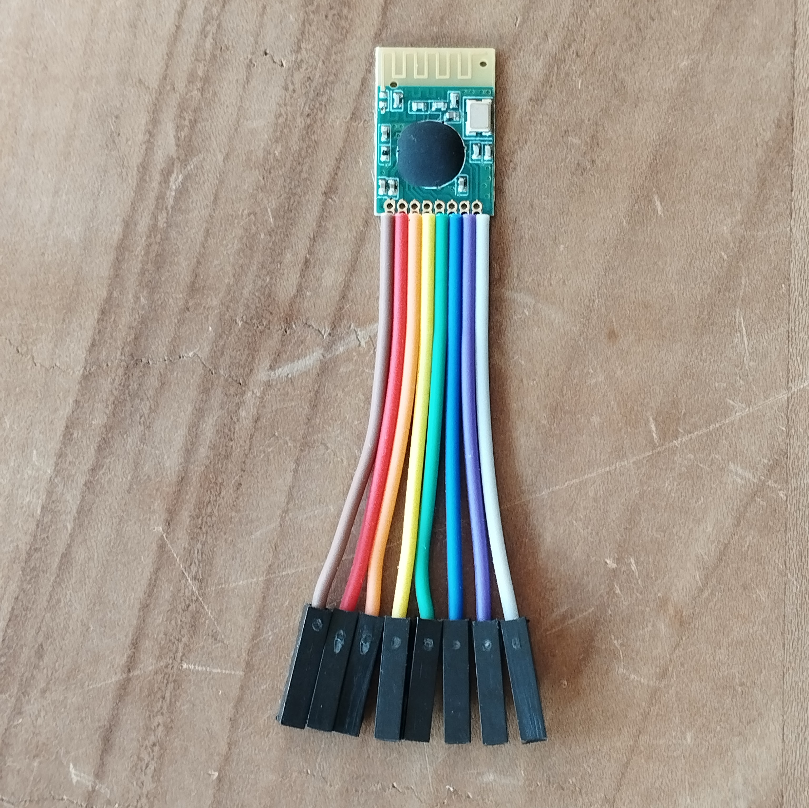
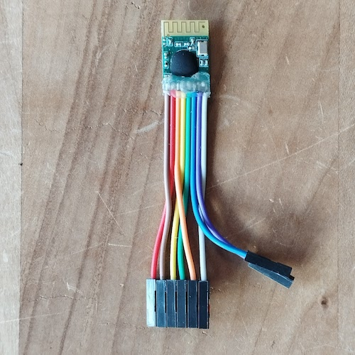
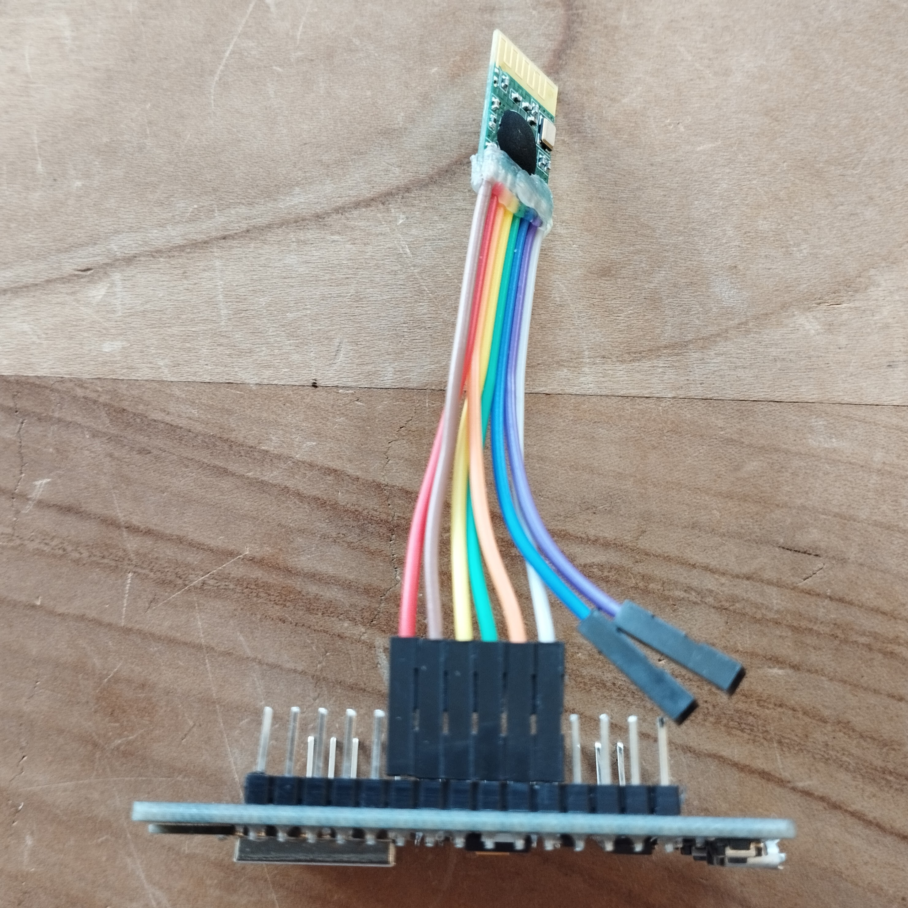

# Texas Instruments CC2500 Low-Power 2.4 GHz RF Transceiver component for ESPHome.

[![GitHub Release][releases-shield]][releases]
[![Licence][license-shield]][license]
[![Maintainer][maintainer-shield]][maintainer]  
[![Github Sponsors][github-shield]][github]
[![PayPal][paypal-shield]][paypal]
[![BuyMeCoffee][buymecoffee-shield]][buymecoffee]
[![Patreon][patreon-shield]][patreon]

## Introduction

This CC2500 component for ESPHome controls the CC2500 transeiver for sending and receiving data
using a compatible receiver. Other components that depend on the CC2500 component can reference it.

To set up this CC2500 component you first need to place a top-level SPI component which defines the pins to use.

## Hardware required:
- ESP8266, ESP32 or other ESPHome supported microcontroller
- CC2500 transceiver

## Wiring:

|CC2500| ESP8266 |
|:----:|:-------:|
| GND  |    G    |
| VDD  |   3V    |
|  SI  |D7/GPIO13|
| SCLK |D5/GPIO14|
|  SO  |D6/GPIO12|
| GDO2 |D1/GPIO5 |
| GDO0 |         |
| CSn  |D8/GPIO15|





## Configuration variables:
- __cs_pin__ (Required): The pin to use for the chip select of the SPI bus.
- __gdo2_pin__ (Optional): The ESP pin the CC2500 GDO2 pin is connected to.
- __output_power__ (Optional): The output power signals should be transmitted with.

## ESPHome example configuration:
```
esphome:
  name: cc2500

external_components:
  - source: github://rrooggiieerr/esphome-cc2500

esp8266:
  board: nodemcu

# Enable logging
logger:
  level: DEBUG

spi:
  clk_pin: GPIO14
  mosi_pin: GPIO13
  miso_pin: GPIO12

cc2500:
  cs_pin: GPIO15
  gdo2_pin: GPIO5
  output_power: 0xFF
```

## Documentation:

[Texas Instruments CC2500 datasheet](https://www.ti.com/lit/ds/symlink/cc2500.pdf)

## Credits:

[Tor Røttum](https://github.com/torrottum)'s [IKEA Ansluta ESPHome component](https://github.com/torrottum/ikea-ansluta-esphome) was very helpful for making this component.

## Support my work

Do you enjoy using this ESPHome component? Then consider supporting my work using one of the
following platforms, your donation is greatly appreciated and keeps me motivated:

[![Github Sponsors][github-shield]][github]
[![PayPal][paypal-shield]][paypal]
[![BuyMeCoffee][buymecoffee-shield]][buymecoffee]
[![Patreon][patreon-shield]][patreon]

## Hire me

If you're in need for a freelance ESP developer for your project please contact me, you can find my
email address on [my GitHub profile](https://github.com/rrooggiieerr).

[releases]: https://github.com/rrooggiieerr/esphome-cc2500/releases
[releases-shield]: https://img.shields.io/github/v/release/rrooggiieerr/esphome-cc2500?style=for-the-badge
[license]: ./LICENSE
[license-shield]: https://img.shields.io/github/license/rrooggiieerr/esphome-cc2500?style=for-the-badge
[maintainer]: https://github.com/rrooggiieerr
[maintainer-shield]: https://img.shields.io/badge/MAINTAINER-%40rrooggiieerr-41BDF5?style=for-the-badge
[paypal]: https://paypal.me/seekingtheedge
[paypal-shield]: https://img.shields.io/badge/PayPal-00457C?style=for-the-badge&logo=paypal&logoColor=white
[buymecoffee]: https://www.buymeacoffee.com/rrooggiieerr
[buymecoffee-shield]: https://img.shields.io/badge/Buy%20Me%20a%20Coffee-ffdd00?style=for-the-badge&logo=buy-me-a-coffee&logoColor=black
[github]: https://github.com/sponsors/rrooggiieerr
[github-shield]: https://img.shields.io/badge/sponsor-30363D?style=for-the-badge&logo=GitHub-Sponsors&logoColor=ea4aaa
[patreon]: https://www.patreon.com/seekingtheedge/creators
[patreon-shield]: https://img.shields.io/badge/Patreon-F96854?style=for-the-badge&logo=patreon&logoColor=white